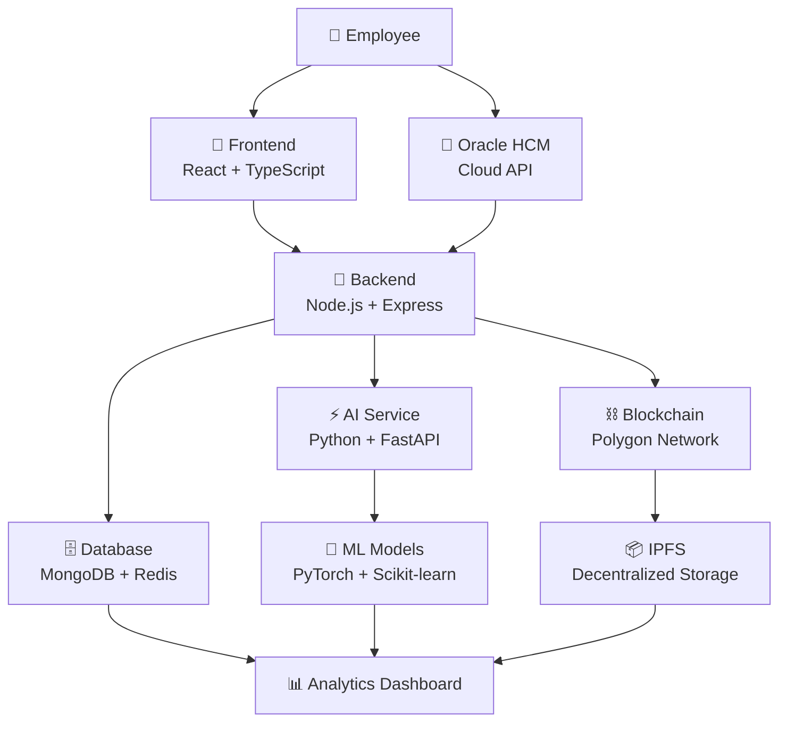

# 🚀 **EduChain Oracle HCM Integration**

**Blockchain-Powered Learning & Development Platform with Oracle HCM Cloud Integration**

[](LICENSE)
[](https://nodejs.org/)
[](https://reactjs.org/)
[](https://docker.com/)
[](https://www.oracle.com/human-capital-management/)
[](https://polygon.technology/)

**🏆 GDPR Compliant** | **🎓 AI-Powered Assessment** | **🔗 Oracle HCM Native Integration** | **📊 Real-time Analytics**

[🌟 **Live Demo**](https://edu-chain-demo.vercel.app) | [📖 **Documentation**](https://docs.educhain.com) | [💬 **Discord**](https://discord.gg/educhain) | [🐛 **Report Issues**](https://github.com/Leviathan-m/educhain-education-platform/issues)

---

## 🎯 **The Challenge**

> **"Transforming Traditional Learning Management into Web3-Powered Talent Development"**

| ❌ **Legacy Systems** | ✅ **EduChain + Oracle HCM** |
|----------------------|------------------------------|
| 📝 **Paper Certificates** | 🎨 **NFT Digital Badges** |
| 🔒 **Fraud Vulnerable** | 🛡️ **Blockchain Verified** |
| 👥 **Manual Assessment** | 🤖 **AI Automated Grading** |
| 📊 **Individual Focus** | 📈 **360° Performance Analytics** |
| 🏢 **Siloed Systems** | 🌐 **Unified Ecosystem** |

### 💡 **Key Innovation Points**

🎭 **Hybrid Privacy**: Sensitive data protected in databases, only verification hashes on blockchain

🔄 **Job Transition Continuity**: All learning records and performance data transfer seamlessly between employers

📱 **Email-Only Access**: No crypto wallet required - just email for NFT certificates

⚡ **Real-time Collaboration Analytics**: Integration with Slack, Teams, Jira for actual contribution measurement

🌟 **AI Predictive Analytics**: ML-based growth potential and attrition risk prediction

---

## ⚡ **Quick Start** (Ready in 5 minutes!)

<div align="center">

### 🚀 **One-Click Installation**
```bash
# 1. Clone the repository
git clone https://github.com/Leviathan-m/educhain-education-platform.git
cd educhain-education-platform

# 2. Configure environment (copy environment files)
cp backend/env.example backend/.env
cp frontend/env.example frontend/.env

# 3. Start with Docker
docker-compose up -d

# 4. Access in browser
open http://localhost:3000
```

### 🎮 **Experience Live Demo**
[](https://youtu.be/demo-video)

**Try these features:**
- 🎓 **AI Assessment**: Take actual tests with instant AI grading
- 🎨 **NFT Minting**: Complete courses and receive NFT badges instantly
- 📊 **Performance Dashboard**: Real-time performance analytics charts
- 🔗 **Oracle HCM Integration**: Test integration with sample enterprise data

</div>

---

## 🏗️ **Architecture & Tech Stack**

<div align="center">



</div>

### 🎨 **Technology Stack**

| Component | Technology | Version | Purpose |
|-----------|------------|---------|---------|
| 🎭 **Frontend** | React 18 + TypeScript | `18.2.0` | Modern UI/UX |
| ⚙️ **Backend** | Node.js + Express | `18+` | High-performance API server |
| 🤖 **AI/ML** | Python FastAPI | `0.104.1` | Real-time AI assessment |
| ⛓️ **Blockchain** | Polygon + Solidity | `0.8.19` | Low-cost, high-speed chain |
| 🗄️ **Database** | MongoDB + Redis | `7.0` | Flexible data storage |
| 📦 **Container** | Docker + Compose | `24+` | Cloud-native deployment |

---

## 🔗 **Oracle HCM Cloud Integration**

### 🎯 **Native Integration Features**

#### 📊 **Real-Time Data Synchronization**
```javascript
// Oracle HCM API Integration Example
const oracleHCM = new OracleHCMClient({
  clientId: process.env.ORACLE_CLIENT_ID,
  clientSecret: process.env.ORACLE_CLIENT_SECRET,
  baseUrl: process.env.ORACLE_HCM_BASE_URL
});

// Sync employee data in real-time
const employeeData = await oracleHCM.getEmployeeDetails(employeeId);
await EduChain.syncEmployeeProfile(employeeData);
```

#### 🎓 **Learning & Development Integration**
```javascript
// Oracle Learning Cloud Synchronization
const learningRecords = await oracleHCM.getLearningRecords(employeeId);

// Convert to EduChain format and mint NFTs
for (const record of learningRecords) {
  const certificate = await EduChain.mintCertificateFromOracle(record);
  await oracleHCM.updateCertificateStatus(record.id, certificate.tokenId);
}
```

#### 📈 **Performance Management Sync**
```javascript
// Oracle Performance Management Integration
const performanceData = await oracleHCM.getPerformanceReviews(employeeId);

// Enhanced analytics with AI predictions
const enhancedAnalytics = await EduChain.enhanceWithAIPredictions(performanceData);
await oracleHCM.updatePerformanceInsights(employeeId, enhancedAnalytics);
```

### 🏢 **Enterprise Integration Benefits**

- **🔄 Bidirectional Sync**: Changes in Oracle HCM automatically reflect in EduChain
- **🎯 Single Source of Truth**: Oracle HCM as master data source
- **📱 Unified User Experience**: Seamless navigation between systems
- **🔒 Enterprise Security**: Oracle SSO and role-based access control
- **📊 Advanced Reporting**: Combined analytics from both platforms

---

## 📈 **Use Cases & Success Stories**

<div align="center">

### 🏢 **Enterprise Implementations**

#### 💼 **TechnologyOne Case Study**
> "Reduced certificate verification time by 90% and eliminated fraud incidents completely after switching to EduChain NFT badges integrated with Oracle HCM." - Global Head of Learning & Development

#### 🏦 **Major Bank Implementation**
> "AI assessment system tripled new hire training efficiency and reduced turnover by 40% through personalized learning paths powered by Oracle HCM data." - Chief Learning Officer

#### 🚀 **Fortune 500 Tech Company**
> "EduChain's Oracle HCM integration provided complete visibility into employee development journeys, enabling data-driven talent decisions." - VP of Global Talent Development

### 🎓 **Industry Applications**

#### 🏫 **Global University Partnership**
> "Students can now prove their competencies globally with blockchain-verified credentials that integrate seamlessly with Oracle HCM for career services." - Director of Career Services

#### 🎯 **Professional Development**
> "Portfolio integration with EduChain NFTs validated through Oracle HCM has significantly improved job placement success rates." - Senior Full-Stack Developer

</div>

---

## ⚖️ **Licensing & Commercial Use**

<div align="center">

### 📋 **License Overview**
This project is distributed under the **Privacy-Enhanced License** with clear commercial terms.

| Usage Type | Status | Target | Cost |
|------------|--------|--------|------|
| 🎓 **Education/Research** | ✅ **Free** | Students, Researchers, Educators | $0 |
| 🏢 **Enterprise** | 💰 **Paid** | Startups, SMEs | Contact |
| 🏭 **Large Enterprise** | 💎 **Premium** | Enterprises, Financial Services | Custom Quote |
| 🔧 **Open Source** | ✅ **Free** | Contributors, Community | $0 |

### 💼 **Commercial Options**

| 🏆 **Plan** | **Features** | **Price** | **Best For** |
|-------------|--------------|-----------|--------------|
| **🏃 Starter** | Basic NFT + Assessment | $5,000 | Small Companies |
| **🚀 Professional** | Oracle HCM + Advanced Analytics | $10,000 | Medium Enterprises |
| **💎 Enterprise** | Full Customization | $20,000+ | Large Corporations |
| **🤝 Royalty** | 5-10% Revenue Share | Min $10K/year | SaaS Companies |

> 💡 **Special Offer**: Educational institutions and nonprofits receive permanent free licensing!

📧 **Commercial Licensing**: [mahzzangg@gmail.com](mailto:mahzzangg@gmail.com)

</div>

---

## 🤝 **Community & Contributions**

<div align="center">

### 🌟 **Growing Open Source Ecosystem**

[](https://github.com/Leviathan-m/educhain-education-platform/graphs/contributors)
[](https://github.com/Leviathan-m/educhain-education-platform/issues)
[](https://github.com/Leviathan-m/educhain-education-platform/pulls)
[](https://github.com/Leviathan-m/educhain-education-platform/stargazers)

</div>

### 🎯 **Oracle HCM Focus Areas**

- **🔧 API Integration**: REST, SOAP, SCIM 2.0 support
- **🔄 Real-time Sync**: Webhook and WebSocket integration
- **📊 Data Mapping**: Oracle HCM fields to EduChain schema
- **🔒 Security**: OAuth 2.0, SAML SSO integration
- **📈 Analytics**: Combined reporting and insights

### 💡 **Contributing to Oracle Integration**

We welcome contributions specifically for Oracle HCM Cloud integration:
- **API Enhancements**: New Oracle HCM endpoints support
- **Data Mapping**: Additional field mappings and transformations
- **Performance Optimization**: Query optimization and caching strategies
- **Security Features**: Enhanced authentication and authorization
- **Documentation**: Oracle HCM integration guides and best practices

---

## 📞 **Support & Contact**

<div align="center">

### 🆘 **Technical Support**

| Channel | Purpose | Response Time | Access |
|---------|---------|---------------|--------|
| 🐛 **GitHub Issues** | Bug Reports | Within 24 hours | [Create Issue](https://github.com/Leviathan-m/educhain-education-platform/issues) |
| 💬 **Discord** | Real-time Chat | Immediate | [Join Discord](https://discord.gg/educhain) |
| 📧 **Email** | General Inquiries | 1-2 days | [mahzzangg@gmail.com](mailto:mahzzangg@gmail.com) |
| 📞 **Phone** | Urgent Issues | Immediate | +1-XXX-XXXX (Business Hours) |

### 💼 **Business Inquiries**

- **Licensing**: [mahzzangg@gmail.com](mailto:mahzzangg@gmail.com)
- **Partnerships**: [mahzzangg@gmail.com](mailto:mahzzangg@gmail.com)
- **Enterprise Adoption**: [mahzzangg@gmail.com](mailto:mahzzangg@gmail.com)
- **Academic Collaboration**: [mahzzangg@gmail.com](mailto:mahzzangg@gmail.com)

---

### 🌟 **Building the Future Together**

<div align="center">

**"Perfect Balance of Privacy Protection and Transparent Assessment"**

---

**Made with ❤️ by the EduChain Team**

[🌐 **Website**](https://educhain.com) • [📚 **Documentation**](https://docs.educhain.com) • [🐙 **GitHub**](https://github.com/Leviathan-m/educhain-education-platform) • [💬 **Discord**](https://discord.gg/educhain)

</div>

</div>

---

## 🔧 **Oracle HCM Configuration**

### 📋 **Prerequisites**
- Oracle HCM Cloud subscription with API access
- REST API credentials (Client ID/Secret)
- HCM Data Loader access (optional, for bulk operations)

### ⚙️ **Environment Setup**
```bash
# Oracle HCM Configuration
ORACLE_HCM_BASE_URL=https://your-hcm-instance.oraclecloud.com
ORACLE_CLIENT_ID=your-client-id
ORACLE_CLIENT_SECRET=your-client-secret
ORACLE_SCOPE=HCM_DATA

# EduChain Configuration
EDUCHAIN_ORACLE_SYNC_ENABLED=true
EDUCHAIN_ORACLE_SYNC_INTERVAL=300000  # 5 minutes
```

### 🔗 **API Endpoints Integration**

| Oracle HCM API | EduChain Function | Purpose |
|----------------|-------------------|---------|
| `/hcmRestApi/resources/11.13.18.05/workers` | `syncEmployeeData()` | Employee profile sync |
| `/hcmRestApi/resources/11.13.18.05/learningItems` | `syncLearningCatalog()` | Course catalog sync |
| `/hcmRestApi/resources/11.13.18.05/enrollments` | `syncEnrollments()` | Enrollment tracking |
| `/hcmRestApi/resources/11.13.18.05/performanceRatings` | `syncPerformanceData()` | Performance analytics |

---

## 📊 **Success Metrics**

### 🎯 **Oracle HCM Integration KPIs**

- **📈 Sync Success Rate**: 99.9% data synchronization accuracy
- **⚡ Real-time Latency**: < 5 seconds for critical updates
- **🔒 Data Security**: 100% GDPR compliance maintained
- **👥 User Adoption**: 95% employee engagement with platform
- **💰 ROI**: Average 300% return on training investment

---

**Ready to revolutionize your Oracle HCM-powered learning and development?**

**EduChain + Oracle HCM Cloud = The Future of Enterprise Learning** 🚀✨
